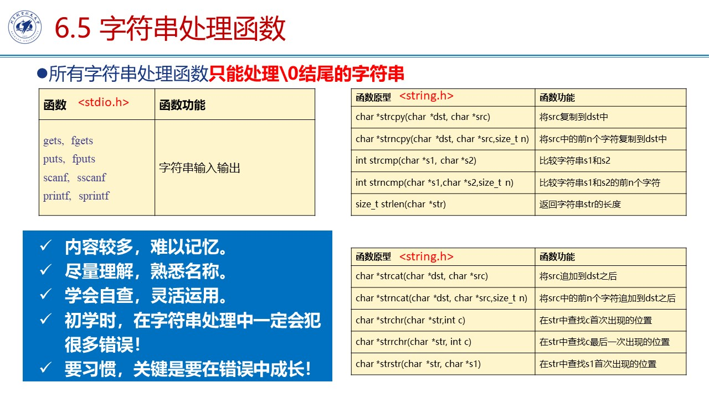

## 第六讲 数组的综合
1. 数组作为函数参数
   + `void func(double va[], double vb[])` 本质将首项的地址赋给形参 `&va[0]`
   + 调用函数时 **不需要加[],直接带入名**
   + 对于数组的修改，在函数结束后依然有效
2. 冒泡排序
    + 遍历n次，每一次将第i大的数挑出来放到最后
    + 稳定性 ： 无（相等元素下标在排序后能够正序）
    + **优化：没有发生交换数据时，提前结束！！**
    + 易错点：内层循环`for(int j = 1; j < n - i - 1; j++)` (从0开始计数)
3. 折半查找 
    + 前提：有序数组
4. 字符串
    + **字符串以`\0`结束，即最后一项是`\0`**
    + 输入： 使用`%s`作为占位符 自动补`\0`。
        + 如果字符串中含有空格，那么一定要用 `gets(s)`，读入整个一行
        + `puts(s)` 自动补回车。 
        + `gets(s) == NULL` 输入结束
    + 指定了字符串长度后，必须要有空间放`\0`
    + 几个常用函数: sprintf sscanf
    + 常用函数
      + `strlen(s)`只支持以`\0`结束的字符串
      + `sizeof(s) / sizeof(char)` 支持任何字符串数组 
      + `int strcmp(char s1[]],char s2[]);` 使用场景：比较字符串相同
      + `int strncmp(char s1[],char s2l],size t n);` 使用场景：比较字符串前n位相同
    + 混用scanf gets可能出现问题， gets会读到scanf那一行的`\n`，导致读入空串。
5. 二维数组
    1. 内存本质上是一维结构，但行优先的方式依次储存 因而`a[1][0]`即为`a[0][3]`
    2. 字符二维数组，相当于多个字符串！
    + eg.
```C
 char weekName[][12] =
 {"Sunday","Monday","Tuesday","Wednesday","Thursday","Friday","Saturday"};
```