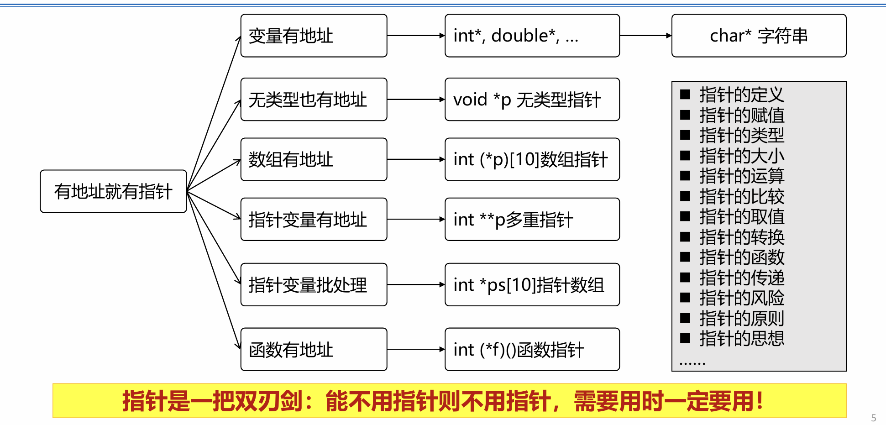

## 第八讲 指针进阶
+ 课前练习 `char *stu[20] = {"Wang", "Liu", "zhang"};`
  + `[]`优先级高于`*`,因而先看`stu[20]`, 是一个长度为20的数组
  + 存储的是每个字符串首地址
  + `stu[1]` 指 `"Liu"`的首地址
  + `*stu[q]` 是`"Liu"`首地址指向的字符，即`"L"`
+ 
*** 
1. 数组类型与数组指针
    + 数组指针：指向整个数组的指针
        ```C
        int a[10];
        int (*pa)[10] = &a;//本质上是二重指针
        //取出其中一个数
        (*pa)[1] = 5;
        //指针加法时，就会以整个数组为单位移动
        (*pa) += 1;
        ```
    + 二维数组指针
        ```C
        int a[2][3] = {{1,2,3}, {4,5,6}};
        // a 指向第一行全部 是二重地址
        ```
        + `*a` 就是第一行首地址 
        + `*a + 1`
2. 函数指针
    + 未知类型 void 
    + 调用函数
